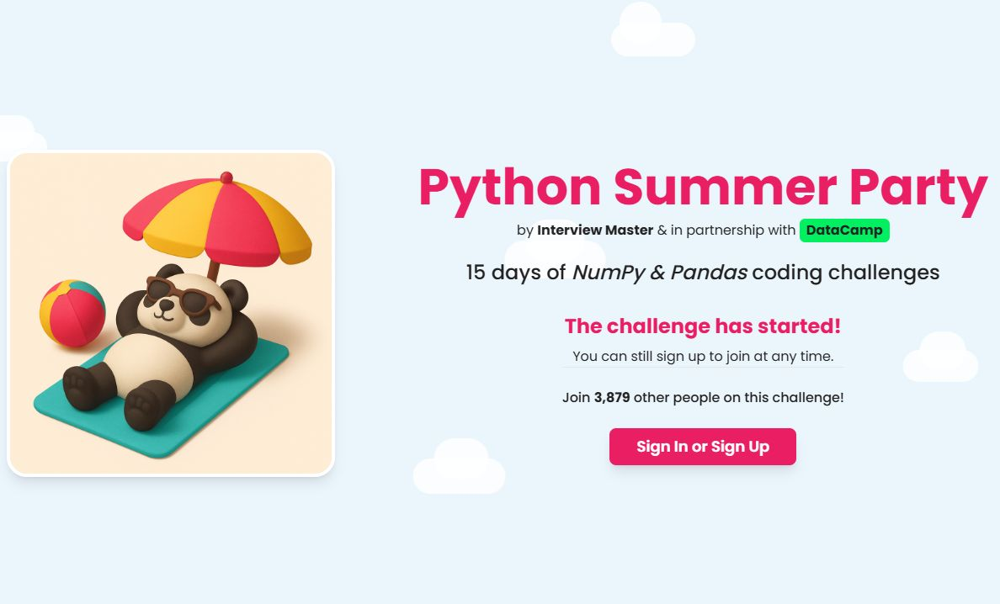

# Python Summer Party 
This 15-day, Python Themed (using Python libraries), challenge involves solving real-world style questions. The platform being used is interview master and the challenge was created in partnershp with DataCamp. 

## What does the challenge include?

 * One Python challenge per day with 3 questions
 * The focus is on Data skills using tools like NumPy, Pandas, and Python
 * All questions based on real companies with real-world scenarios 
 * Easy, intermediate, and harder questions are available.
 * There is an AI chat bot for assistance. 
 * There is a Discord community to join. 
 * There are some DataCamp subscription prizes for those who finish the challenge. 
 * Best feature--it is fun and free to participate. 

Link: <https://www.interviewmaster.ai/python-party>

## My Projects:
&nbsp;&nbsp;&nbsp;&nbsp;**Project Ratings:** Easy, Medium, Hard
- [Day 1](https://github.com/EO4wellness/python_summer_party/blob/main/tasks/day1/day1.py) – WhatsApp (Easy) 
- [Day 2](#) – Amazon (Medium) 
- [Day 3](https://github.com/EO4wellness/python_summer_party/blob/main/tasks/day3/day3.py) – Disney (Hard) 
- [Day 4](#) – Google (Easy) 
- [Day 5](#) – Nintendo (Hard) 
- [Day 6](#) – Ben & Jerry's (Hard) 
- [Day 7](#) – Nike (Easy) 
- [Day 8](#) – Lululemon (Medium) 
- [Day 9](#) – Meta (Medium) 
- [Day 10](#) – Apple (Easy) 
- [Day 11](#) – Stripe (Medium) 
- [Day 12](#) – Walmart (Medium) 
- [Day 13](#) – Shake Shack (Medium) 
- [Day 14](#) – Starbucks (Hard) 
- [Day 15](#) – Uber (Hard) 

## Reflections: 
coming soon 

